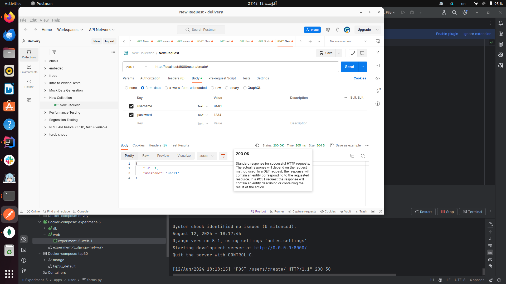
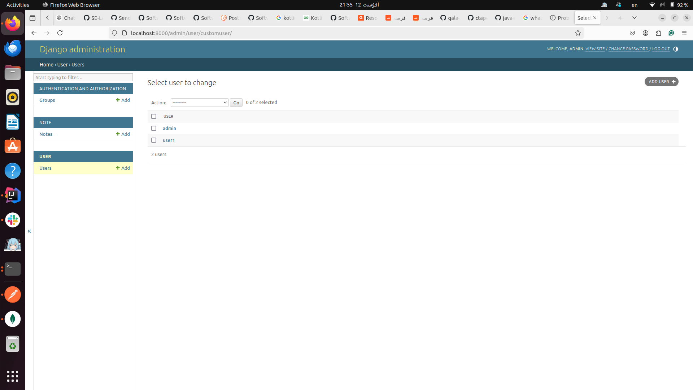
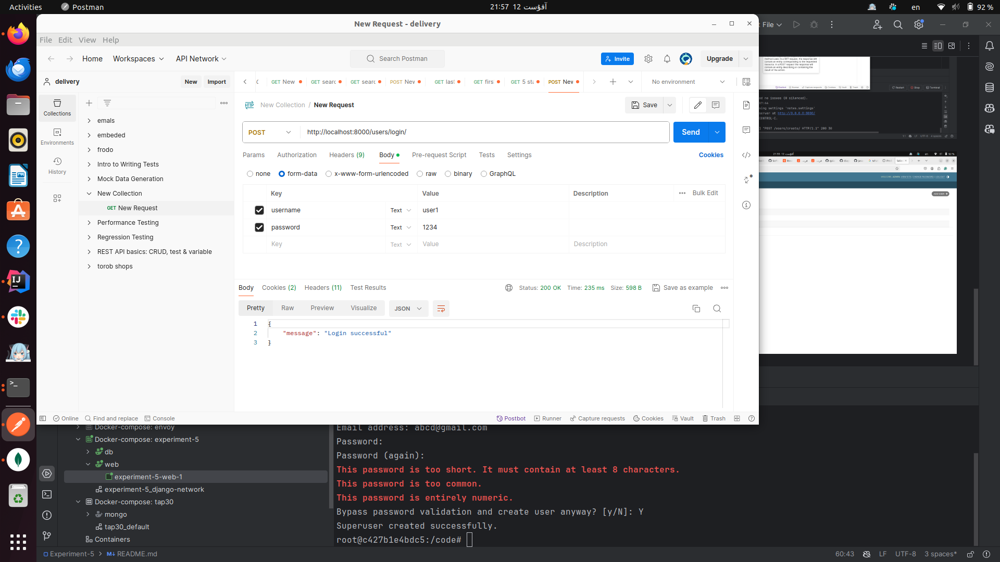
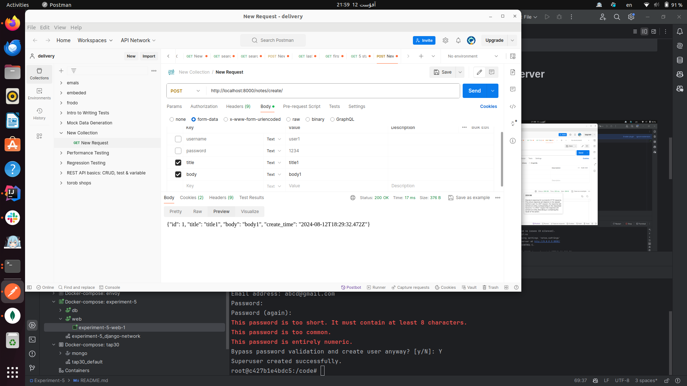
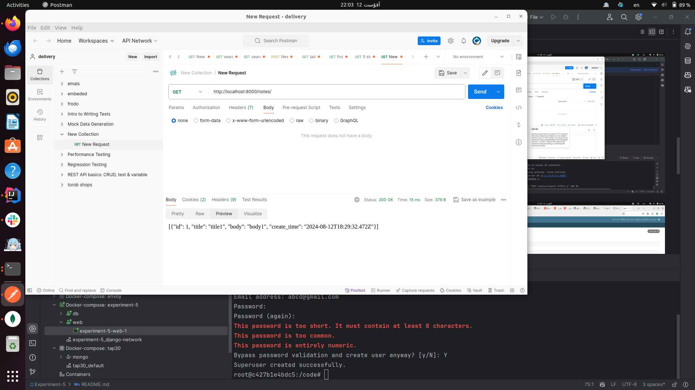
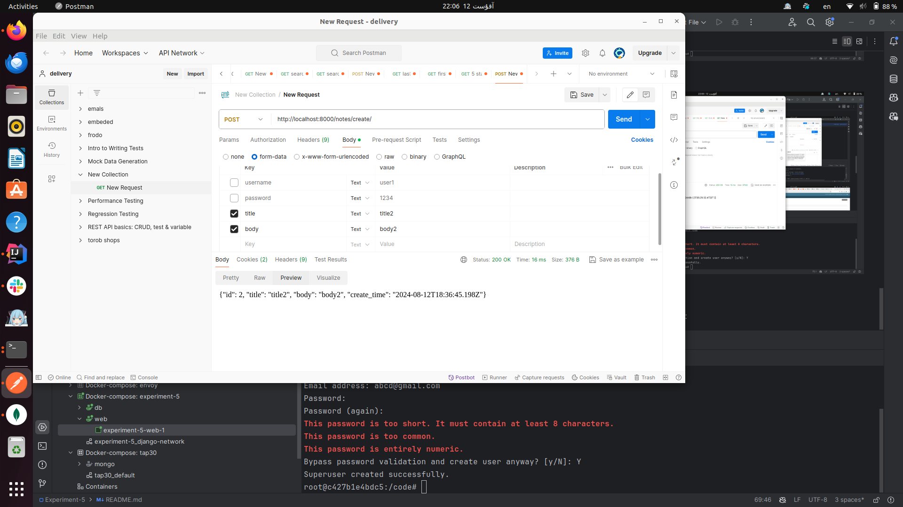
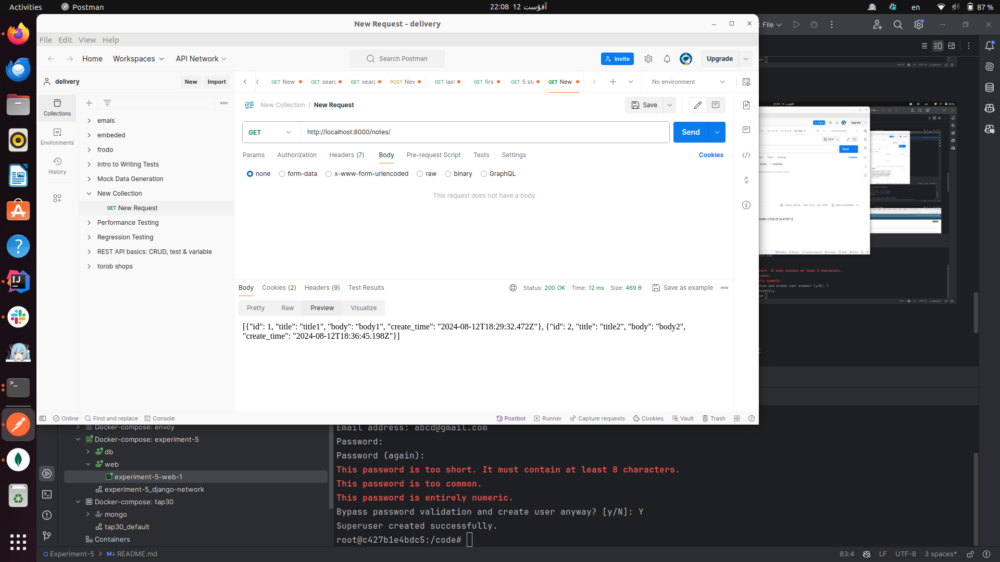
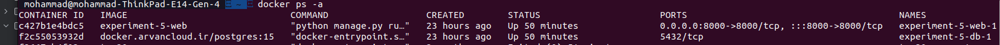
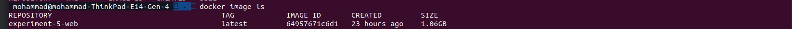
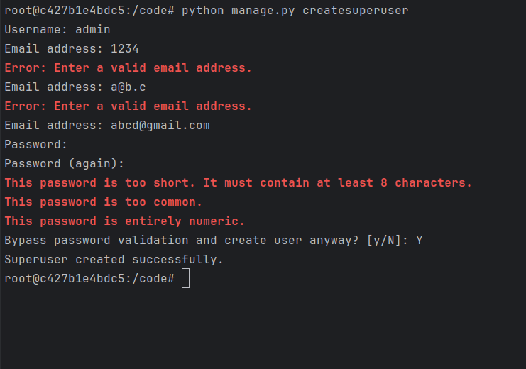

# Notes project

## Requirements
- Python3
- Postgres

## How to run

### Setup virtual environment

#### Create venv
```
python -m venv ./venv
```

#### Install requirements
```
python -m pip install -r requirements.txt
```

#### Activate venv
```
source ./venv/bin/activate
```

### Setup database
1. Create an instance of postgres database
2. Make migrations
    ```
    python manage.py makemigrations
    ```
3. Migrate
    ```
    python manage.py migrate
    ```

### Create an admin
```
python manage.py createsuperuser
```

## Important end-points
```
users/login/ --> login a user
users/me/ --> get information of logged-in user
users/create/ --> create a user
users/<id>/delete/ --> delete a user
notes/ --> list all notes of current user
notes/<id>/ --> get details of a note
notes/create/ --> create a note
notes/<id>/delete/ --> delete a note
```


-------------------
کدی که در docker-compose قرار گرفت :‌

```
version: '3.8'

services:
  db:
    image: docker.arvancloud.ir/postgres:15
    environment:
      POSTGRES_DB: postgres
      POSTGRES_USER: postgres
      POSTGRES_PASSWORD: 12345678
    volumes:
      - postgres_data:/var/lib/postgresql/data
    networks:
      - django-network

  web:
    build: .
    command: python manage.py runserver 0.0.0.0:8000
    volumes:
      - .:/code
    ports:
      - "8000:8000"
    depends_on:
      - db
    environment:
      - DATABASE_NAME=postgres
      - DATABASE_USER=postgres
      - DATABASE_PASSWORD=12345678
      - DATABASE_HOST=db
    networks:
      - django-network

volumes:
  postgres_data:

networks:
  django-network:
```

### توضیحات مربوطه :‌

نسخه: نسخه‌ی '3.8' مشخص‌کننده‌ی نسخه‌ی فرمت فایل Docker Compose است.

سرویس‌ها:

###  db:

Image:

 از تصویر رسمی PostgreSQL postgres:13 استفاده می‌کند.

Environment Variables:

 تنظیمات نام دیتابیس، کاربر، و رمز عبور را انجام می‌دهد.

Volumes:

 داده‌های PostgreSQL را بین ریستارت‌های کانتینر با استفاده از یک حجم نام‌گذاری‌شده postgres_data حفظ می‌کند.

Networks:

 به شبکه‌ی django-network متصل می‌شود که امکان ارتباط بین برنامه‌ی Django و PostgreSQL را فراهم می‌کند.

### web:
Build: 

تصویر Docker را از Dockerfile در دایرکتوری جاری می‌سازد.


Command:

 سرور توسعه‌ی Django را اجرا می‌کند.


Volumes:

 دایرکتوری جاری را در کانتینر در مسیر /code متصل می‌کند.


Ports:

 پورت 8000 در میزبان را به پورت 8000 در کانتینر متصل می‌کند.


Depends_on:

 اطمینان حاصل می‌کند که کانتینر PostgreSQL db قبل از کانتینر Django شروع به کار می‌کند.


Environment:

 متغیرهای محیطی مورد نیاز برای اتصال Django به PostgreSQL را تنظیم می‌کند.


Networks:

 به همان شبکه‌ی django-network که دیتابیس در آن قرار دارد متصل می‌شود.

Volumes:

 یک حجم نام‌گذاری‌شده به نام postgres_data برای ذخیره‌ی داده‌های PostgreSQL تعریف می‌کند.

Networks:

 یک شبکه‌ی سفارشی به نام django-network تعریف می‌کند تا ارتباط بین سرویس‌ها را امکان‌پذیر سازد.


## Send request to web server

### 1

Create user1:





### 2
Login as user1:



creating note with title1 and body1 for user1:



get created note:



### 3

creating note with title2 and body2 for user1:



### 4

get both notes:



## Task

### 1
get containers: `docker ps -a`



get images: `docker image ls`



### 2

with these commands in container, we have made an admin:



## Questions

### 1

داکرفایل : داکر فایل یک فایل متنی است که دستورالعمل‌هایی برای نحوه ساخت یک داکر را در خود دارد.
این فایل مشخص می‌کند که برای ایجاد یک تصویر قابل استفاده، چه مراحلی باید انجام شود، از جمله اینکه از چه سیستم عاملی استفاده شود، چه نرم‌افزاری نصب شود و چگونه تصویر پیکربندی شود.
داکر فایل ها برای خودکارسازی فرآیند ساخت تصویر استفاده می‌شوند و ساخت تصاویر سازگار و قابل تکرار را آسان‌تر می‌کنند.

تصاویر (Images) قالب‌های فقط خواندنی هستند که دستورالعمل‌های لازم برای ایجاد یک کانتینر را در بر دارند.
آن‌ها شامل سیستم‌عامل، نرم‌افزار و اطلاعات پیکربندی هستند که برای اجرای یک برنامه لازم است.
تصاویر در یک رجیستری داکر ذخیره می‌شوند که یک مخزن مرکزی برای ذخیره و توزیع تصاویر داکر است.

کانتینرها (Containers) نمونه‌های در حال اجرای تصاویر داکر هستند.
آن‌ها محیط‌های ایزوله‌ای هستند که می‌توانند یک برنامه و تمام وابستگی‌های آن را اجرا کنند.
کانتینرها از تصاویر ایجاد می‌شوند و سیستم‌فایل فقط خواندنی تصویر را به اشتراک می‌گذارند.
این ویژگی باعث می‌شود که کانتینرها سبک و قابل حمل باشند، زیرا فقط شامل تغییراتی هستند که برای اجرای برنامه نیاز است.

### 2

کوبرنیتیس (Kubernetes) یک پلتفرم اپن سورس ارکستراسیون کانتینر است که به‌طور خودکار فرآیندهای استقرار، مقیاس‌پذیری و مدیریت برنامه‌های کانتینری شده را انجام می‌دهد.
این پلتفرم کانتینرها را در واحدهای منطقی به نام پاد (Pod) گروه‌بندی می‌کند که می‌توانند تکثیر شده و در یک خوشه از نودها توزیع شوند.
کوبرنیتیس همچنین خدماتی برای کشف و مدیریت کانتینرها و توزیع ترافیک بین آن‌ها فراهم می‌کند.

کوبرنیتیس می‌تواند برای مدیریت کانتینرهای داکر و همچنین کانتینرهایی که با سایر فناوری‌های کانتینرسازی ساخته شده‌اند، استفاده شود.
این ابزار قدرتمندی برای استقرار و مدیریت برنامه‌های پیچیده در مقیاس بزرگ است.


رابطه بین داکر و Kubernetes

داکر و کوبرنیتیس فناوری‌های مکملی هستند که می‌توانند با هم برای ساخت و مدیریت برنامه‌های کانتینری شده استفاده شوند.
داکر برای ساخت و بسته‌بندی تصاویر کانتینری به کار می‌رود، در حالی که کوبرنیتیس برای استقرار، مقیاس‌پذیری و مدیریت آن کانتینرها در محیط تولید استفاده می‌شود.


